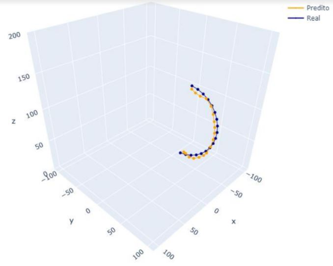

# Modeling and simulating inverse kinematics of a robotic arm using neural networks

**This project was developed as a final project of Robotics Engineer Bachelor at Universidade Federal do ABC**

**You can read the full work [here](https://drive.google.com/file/d/125PrjD0Q0v2bcdmn96Kus-rb2KmGigdM/view?usp=sharing)**

## Authors:
- Lucas Nicolau Aperguis
- Pedro Gabriel Gengo Lourenço

## Description

This project explores the study and implementation of dense neural networks (NN), also known as Multilayer Perceptron, to solve inverse kinematics of an articulated robotic manipulator with 3 degrees of freedom and rotational joints. We were interested to find the angle vector for joints only using the end-effector position. There were developed algorithms to generate data and train the neural networks responsible for solving the inverse kinematics for this kind of robotic manipulator. We used Python to develop this project, with its libraries for neural networks, like TensorFlow. Two different approaches were compared for using neural networks to evaluate which approach presented lower error, one with a single neural network, which covers all over the workspace, and another one using two neural networks, each specific for a workspace region. The results were evaluated using test paths and have shown that neural networks are feasible to solve the problem, but there are improvements to make
to achieve higher precisions.

## Methodology:

Summarizing, we developed a Class to simulate our Robotic arm, where we can apply the direct kinematics. With this class we can visualize the graph in a 3D environment. After that, we generate pairs of axis angles, denoted by $\theta$, and the endeffector's coordinates. After, we invert this, and use the coordinates as our inputs and $\theta$'s as our output. With this dataset we trained a neural network and validate in a real path, as we can see in following figures.

We experiment two different strategies:

- Single Neural Network: we trained a single neural network using all dataset.

- Specialized Neural Networks per work zone region: we splitted our dataset in two different regions and trained a NN for each one.

## Neural Network Architecture:

- Input and output layer with 3 units;
- 7 hidden layers;
- 256 units in each hidden layer;
- ReLU;
- 20% Dropout;
- Adam (lr = 0.01) optimizer with inverse time decay;
- 1000 epochs.

## Results

We achieved best results using the strategy of specialized neural networks. Below, we can see the results of each strategy:

- Single Neural Network:

- Specialized Neural Networks:

